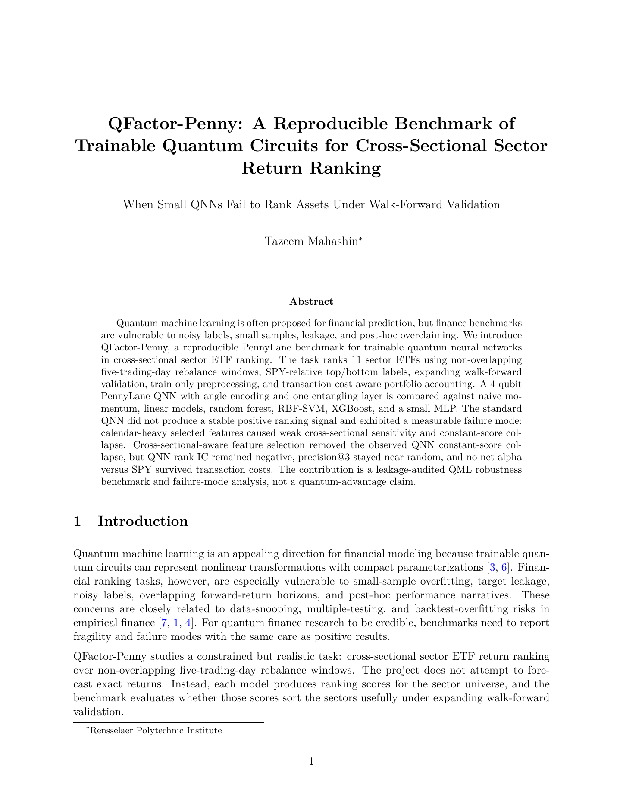

<p align="center">
  
</p>

<h1 align="center">QFactor-Penny</h1>

<p align="center">
  <strong>A leakage-aware PennyLane benchmark for trainable quantum circuits in cross-sectional sector ETF return ranking.</strong>
</p>

<p align="center">
  <a href="https://youtu.be/jAKgiCHIuVY">Demo Video</a>
  ·
  <a href="paper/qfactor_penny_paper.pdf">Paper PDF</a>
  ·
  <a href="paper/qfactor_penny_paper.md">Markdown Paper</a>
</p>

<p align="center">
  
  
  
  
  
</p>

<p align="center">
  <a href="https://youtu.be/jAKgiCHIuVY">
    
  </a>
</p>

> **TL;DR:** Cross-sectional-aware feature selection removed QNN constant-score collapse, but the QNN still showed negative rank IC, near-random precision@3, and no post-cost alpha versus SPY.

## Best Way to Review

1. Watch the [demo video](https://youtu.be/jAKgiCHIuVY).
2. Read the [paper abstract](paper/qfactor_penny_paper.pdf) and the standard vs cross-sectional-aware QNN table.
3. Inspect [`results/experimental_variant_comparison.csv`](results/experimental_variant_comparison.csv).
4. Run [`configs/mvp.yaml`](configs/mvp.yaml) for the fast benchmark path.

## Overview

QFactor-Penny evaluates whether a small trainable PennyLane quantum neural network can produce useful cross-sectional ranking scores for sector ETFs under realistic financial validation constraints. The benchmark ranks 11 SPDR sector ETFs over non-overlapping five-trading-day rebalance windows, trains on SPY-relative top/bottom labels, scores all sectors at inference, and evaluates long top-3 portfolios using absolute ETF returns after transaction costs.

The result is intentionally not framed as a performance win. The project found a measurable QNN failure mode: standard feature selection sometimes chose calendar-heavy inputs with weak within-date cross-sectional dispersion, causing constant or near-constant QNN scores. Cross-sectional-aware feature selection removed that collapse, but it did not create a robust ranking signal or post-cost alpha.

> Cross-sectional-aware feature selection removed the observed QNN constant-score collapse, but QNN rank IC remained negative, precision@3 stayed near random, and no net alpha versus SPY survived transaction costs.

This is a reproducible failure-mode benchmark, not a quantum-advantage claim and not a trading system.

## Why This Matters

Finance QML benchmarks can look impressive if leakage, overlapping labels, weak baselines, or post-hoc tuning are ignored. QFactor-Penny is designed to expose those failure modes directly. The negative result is the point: a cleaner QNN diagnostic did not create a reliable ranking signal.

## Current Result Snapshot

| QNN diagnostic | Standard MVP | Cross-sectional-aware MVP |
| --- | ---: | ---: |
| Constant-score groups | 4 | 0 |
| Calendar-heavy selected feature share | 40% | 0% |
| Rank IC | -0.0735 | -0.0494 |
| Precision@3 | 0.2292 | 0.2708 |
| Random precision@3 baseline | 0.2727 | 0.2727 |
| Alpha vs SPY after costs | -0.0004 | -0.0006 |
| Turnover | 0.5521 | 0.6562 |

The diagnostic improved the mechanics of the QNN scoring behavior, but the investment-style signal remained weak. Precision@3 stayed near the random baseline of `3 / 11 = 0.2727`, rank IC remained negative, and no net alpha versus SPY survived transaction costs.

## Methodology

| Component | Design |
| --- | --- |
| Benchmark ticker | `SPY` |
| Tradable universe | `XLB`, `XLC`, `XLE`, `XLF`, `XLI`, `XLK`, `XLP`, `XLRE`, `XLU`, `XLV`, `XLY` |
| Horizon | Next 5 trading days |
| Rebalance dates | Non-overlapping 5-trading-day windows |
| Label | Top 3 SPY-relative sectors = `1`; bottom 3 = `0` |
| Middle sectors | Dropped from classification training, included in inference/ranking |
| Validation | Expanding walk-forward splits with train-only preprocessing |
| Leakage control | Configurable `purge_trading_days` around target horizons |
| Portfolio | Equal-weight long top 3 sectors, held for the next 5 trading days |
| Return accounting | Absolute ETF forward returns, not SPY-relative target returns |
| Transaction cost | `turnover * 0.0005` |
| Alpha definition | `portfolio_net_return - spy_forward_return` |

SPY is a benchmark/reference ticker only. It is never selected in sector portfolios.

## Models

The QNN is deliberately small:

- 4 selected/scaled features
- 4 qubits
- angle encoding
- 1 `StronglyEntanglingLayers` layer
- analytic PennyLane simulator for training
- scalar expectation output used as the ranking score
- inference-only 1024-shot sensitivity check after analytic training

Classical baselines:

- naive momentum rank
- logistic regression
- ridge linear classifier
- random forest
- RBF SVM
- small one-hidden-layer MLP
- XGBoost when installed; skipped cleanly otherwise

The goal is not to exhaust every classical model family. The goal is to compare the QNN against nontrivial lightweight baselines while keeping the experiment auditable.

## Repository Map

```text
qfactor_penny/                  Benchmark package and CLI modules
configs/                        MVP, full, and feature-selection configs
tests/                          Unit and smoke tests
paper/                          Markdown, LaTeX, PDF, and bibliography
results/                        Current standard MVP artifact outputs
results_cross_sectional_mvp/    Current cross-sectional-aware MVP artifact outputs
assets/                         README logo and paper thumbnail
requirements.txt                Runtime/test requirements
requirements.lock.txt           Local environment lock snapshot
```

Generated cache directories, local data extracts, stale full-run outputs, and rendered video files are ignored by git. The demo video is hosted externally on YouTube.

## Quickstart

Create an environment and install dependencies:

```bash
python -m venv .venv
.venv/bin/python -m pip install -r requirements.txt
```

Prepare data from the frozen MarketMind-Q sector ETF dataset when available:

```bash
.venv/bin/python -m qfactor_penny.prepare_data \
  --input mktmind-qtm/data/marketmind_qml_dataset.csv \
  --output data/qfactor_dataset.csv
```

The project does not silently download market data. If the input path is unavailable, `prepare_data` creates deterministic synthetic demo data and marks the output as synthetic for smoke testing.

Run the fast MVP benchmark:

```bash
.venv/bin/python -m qfactor_penny.run_benchmark --config configs/mvp.yaml
.venv/bin/python -m qfactor_penny.make_report --config configs/mvp.yaml
```

Run the cross-sectional-aware diagnostic MVP:

```bash
.venv/bin/python -m qfactor_penny.run_benchmark --config configs/cross_sectional_mvp.yaml
.venv/bin/python -m qfactor_penny.make_report --config configs/cross_sectional_mvp.yaml
```

Run tests:

```bash
.venv/bin/python -m pytest
```

## Configs

| Config | Purpose | Output directory |
| --- | --- | --- |
| `configs/mvp.yaml` | Fast standard smoke/research MVP; `max_splits: 4`, `seeds: [42]` | `results/` |
| `configs/cross_sectional_mvp.yaml` | Matched diagnostic MVP with cross-sectional-aware feature selection | `results_cross_sectional_mvp/` |
| `configs/cross_sectional_features.yaml` | Longer cross-sectional-aware diagnostic variant | configured in file |
| `configs/full.yaml` | Slower research config with more splits/seeds | `results_full/` |

The paper conclusions use the current standard MVP and cross-sectional-aware MVP artifacts. `results_full/` is treated as stale/local unless regenerated under the current manifest/status/feature-stability schema.

## Reproducibility Artifacts

Each benchmark output directory includes audit and status files:

| Artifact | Purpose |
| --- | --- |
| `run_manifest.json` | Config hash, dataset hash, package versions, model list, seeds, runtime, git SHA |
| `split_audit.csv` | Train/validation/test dates, purge gaps, and split coverage |
| `prediction_audit.csv` | Confirms all 11 sectors are scored per model/date/seed |
| `model_run_status.csv` | Success/skipped/failed status, prediction counts, constant-score counts |
| `feature_stability_summary.csv` | Train-only feature dispersion and calendar-heavy flags |
| `qnn_failure_audit.csv` | Constant-score QNN date groups and related diagnostics |
| `quantum_diagnostics.csv` | Qubit count, layer count, parameters, timing, shot-sensitivity metrics |
| `portfolio_selection_audit.csv` | Top-3 selection, deterministic rank handling, no SPY portfolio inclusion |
| `undefined_metric_audit.csv` | Metrics that became `NaN` because they were undefined |

The report files `results/results_summary.md` and `results_cross_sectional_mvp/results_summary.md` summarize these artifacts and preserve the no-overclaiming stance.

## Paper and Video

- Paper title: **QFactor-Penny: A Reproducible Benchmark of Trainable Quantum Circuits for Cross-Sectional Sector Return Ranking**
- Subtitle: **When Small QNNs Fail to Rank Assets Under Walk-Forward Validation**
- PDF: [`paper/qfactor_penny_paper.pdf`](paper/qfactor_penny_paper.pdf)
- Markdown: [`paper/qfactor_penny_paper.md`](paper/qfactor_penny_paper.md)
- Demo video: [youtu.be/jAKgiCHIuVY](https://youtu.be/jAKgiCHIuVY)

The video is a short companion explainer. It walks through the task, the QNN constant-score collapse, the cross-sectional-aware diagnostic, and the negative research conclusion.

<p align="center">
  <a href="paper/qfactor_penny_paper.pdf">
    
  </a>
</p>

## What This Project Does Not Claim

QFactor-Penny does not claim:

- quantum advantage
- statistically significant QNN outperformance
- tradable alpha
- real-hardware validation
- investment advice
- a production trading system

The benchmark is designed to expose fragility before making performance claims.

## Limitations

- The current paper-backed MVP comparison uses only 4 walk-forward splits and one seed.
- The tradable universe is small: 11 sector ETFs.
- Financial labels are noisy and short-horizon returns are difficult to rank.
- The QNN is intentionally small and not tuned for best possible performance.
- Shot sensitivity is simulator-based inference after analytic training, not real-hardware execution.
- No statistical-significance claim is made.

## License

MIT License. See [`LICENSE`](LICENSE).
